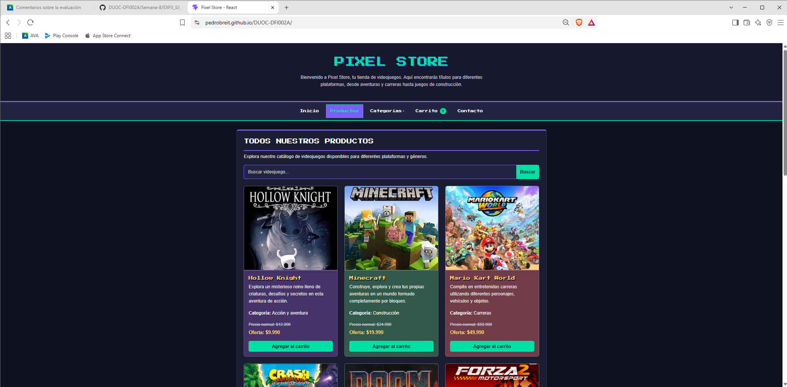
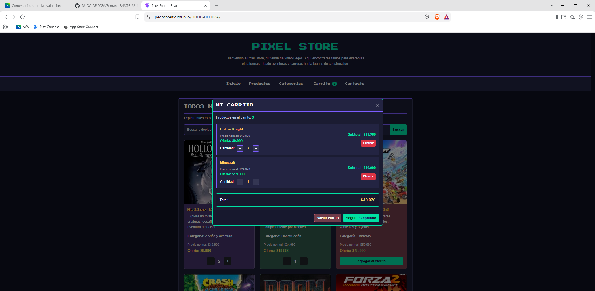
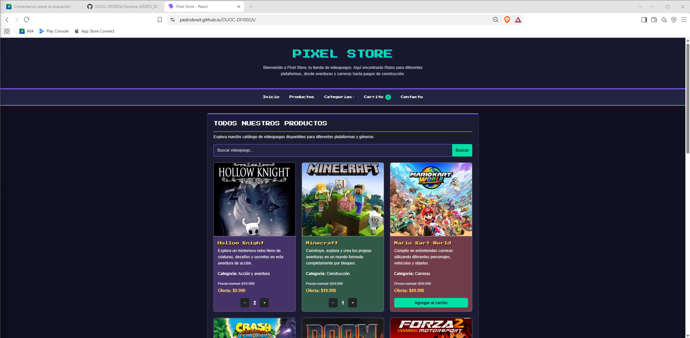
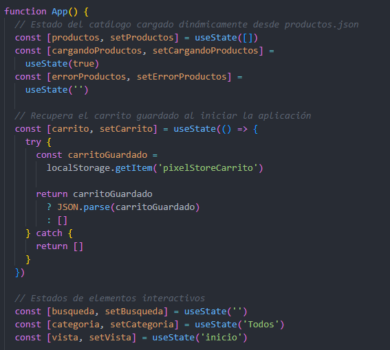
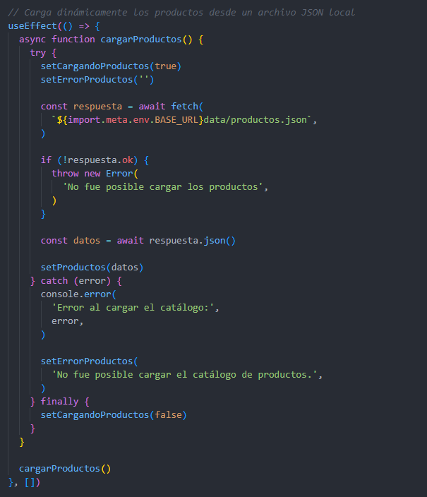

# Pixel Store - Semana 8

Proyecto desarrollado para la asignatura **Desarrollo Frontend I (PFY2201)** de Duoc UC.

Esta entrega corresponde a la **Semana 8 - Mejorando funcionalidades clave en el eCommerce con React**, continuando el desarrollo de Pixel Store realizado durante las semanas anteriores.

---

## Descripción

**Pixel Store** es una tienda de videojuegos desarrollada con React que permite visualizar un catálogo de productos, buscar y filtrar videojuegos, administrar un carrito de compras y actualizar dinámicamente la interfaz según las acciones realizadas por el usuario.

Durante esta etapa del proyecto se reforzó principalmente el uso de los Hooks `useState` y `useEffect`, la carga dinámica de información y el renderizado condicional.

---

## Objetivos de la actividad

En esta entrega se implementaron las siguientes funcionalidades:

- Gestión del catálogo mediante `useState`.
- Gestión del carrito de compras mediante `useState`.
- Manejo de búsqueda, categorías y vistas mediante estados.
- Carga dinámica de productos utilizando `useEffect` y `fetch`.
- Manejo de estados de carga y error.
- Renderizado condicional según el estado de la aplicación.
- Agregar productos al carrito.
- Aumentar y disminuir cantidades.
- Eliminar productos individualmente.
- Vaciar completamente el carrito.
- Cálculo automático de subtotales y total.
- Persistencia del carrito mediante `localStorage`.
- Reutilización de componentes React.
- Publicación de la aplicación mediante GitHub Pages.

---

## Tecnologías utilizadas

- HTML5
- CSS3
- JavaScript
- React
- React Hooks
  - `useState`
  - `useEffect`
- Vite
- Bootstrap 5
- Fetch API
- JSON
- Local Storage
- Git
- GitHub
- GitHub Pages

---

## Estructura del proyecto

```text
tienda-videojuegos/
│
├── public/
│   ├── assets/
│   │   └── img/
│   ├── data/
│   │   └── productos.json
│   └── favicon.svg
│
├── src/
│   ├── components/
│   │   ├── CartModal.jsx
│   │   ├── Footer.jsx
│   │   ├── Header.jsx
│   │   ├── Home.jsx
│   │   ├── Navbar.jsx
│   │   ├── ProductCard.jsx
│   │   ├── ProductList.jsx
│   │   └── SearchBar.jsx
│   │
│   ├── styles/
│   │   └── styles.css
│   │
│   ├── App.jsx
│   └── main.jsx
│
├── eslint.config.js
├── index.html
├── package.json
├── package-lock.json
├── vite.config.js
└── README.md
```

---

# Funcionalidades implementadas

## 1. Catálogo cargado dinámicamente

Los productos se encuentran almacenados en:

```text
public/data/productos.json
```

El catálogo se carga dinámicamente utilizando `fetch` dentro del Hook `useEffect`.

```jsx
useEffect(() => {
  async function cargarProductos() {
    try {
      setCargandoProductos(true)
      setErrorProductos('')

      const respuesta = await fetch(
        `${import.meta.env.BASE_URL}data/productos.json`,
      )

      if (!respuesta.ok) {
        throw new Error(
          'No fue posible cargar los productos',
        )
      }

      const datos = await respuesta.json()

      setProductos(datos)
    } catch (error) {
      console.error(
        'Error al cargar el catálogo:',
        error,
      )

      setErrorProductos(
        'No fue posible cargar el catálogo de productos.',
      )
    } finally {
      setCargandoProductos(false)
    }
  }

  cargarProductos()
}, [])
```

De esta forma, el catálogo comienza vacío y se actualiza cuando finaliza correctamente la carga de datos.

---

## 2. Gestión de estados con useState

La aplicación utiliza diferentes estados para administrar sus funcionalidades principales.

```jsx
const [productos, setProductos] = useState([])
const [cargandoProductos, setCargandoProductos] = useState(true)
const [errorProductos, setErrorProductos] = useState('')
const [carrito, setCarrito] = useState(...)
const [busqueda, setBusqueda] = useState('')
const [categoria, setCategoria] = useState('Todos')
const [vista, setVista] = useState('inicio')
```

Estos estados permiten controlar:

- Catálogo de productos.
- Estado de carga.
- Manejo de errores.
- Carrito de compras.
- Búsqueda.
- Categorías.
- Vista actualmente mostrada.

---

## 3. Carrito de compras

El carrito permite:

- Agregar productos.
- Aumentar unidades.
- Disminuir unidades.
- Eliminar productos.
- Vaciar el carrito.
- Calcular subtotales.
- Calcular el total de la compra.
- Mostrar el número total de unidades en la barra de navegación.

Cuando la cantidad de un producto disminuye hasta `0`, este se elimina automáticamente del carrito.

---

## 4. Persistencia del carrito

Se utiliza `localStorage` para conservar los productos incluso después de actualizar o cerrar la página.

```jsx
useEffect(() => {
  localStorage.setItem(
    'pixelStoreCarrito',
    JSON.stringify(carrito),
  )
}, [carrito])
```

Al iniciar nuevamente la aplicación se recupera el carrito almacenado.

---

## 5. Renderizado condicional

Las tarjetas modifican automáticamente sus controles dependiendo de si el producto se encuentra o no en el carrito.

### Producto no agregado

```text
Agregar al carrito
```

### Producto agregado

```text
−  cantidad  +
```

También se utiliza renderizado condicional para mostrar:

- Estado de carga del catálogo.
- Error durante la carga.
- Carrito vacío.
- Búsqueda sin resultados.
- Vista de inicio o catálogo.

---

## 6. Búsqueda y categorías

Los productos pueden filtrarse según:

- Nombre del videojuego.
- Categoría seleccionada.

Categorías disponibles:

- Acción y aventura
- Carreras
- Construcción
- Arcade
- Plataformas

---

## 7. Componentes reutilizables

Durante el desarrollo se evitó duplicar la lógica utilizada para generar las tarjetas de productos.

El componente:

```text
ProductCard.jsx
```

es utilizado tanto por la sección de productos destacados como por el catálogo completo mediante:

```text
ProductList.jsx
```

Esto permite mantener un código más claro, reutilizable y sencillo de mantener.

---

# Evidencias

## Catálogo cargado dinámicamente

La aplicación obtiene los productos desde un archivo JSON y actualiza el estado del catálogo.



---

## Carrito de compras funcionando

El carrito permite administrar diferentes productos, modificar cantidades, eliminar productos y calcular automáticamente el total de la compra.



---

## Renderizado condicional

Las tarjetas cambian su interfaz según el estado del carrito. Los productos agregados muestran controles de cantidad, mientras que los productos no seleccionados mantienen el botón **Agregar al carrito**.



---

## Gestión de estados con useState

Uso de `useState` para gestionar el catálogo, carrito de compras y diferentes elementos interactivos de la aplicación.



---

## Carga dinámica con useEffect

Implementación de `useEffect`, `fetch`, manejo de errores y actualización del catálogo mediante `setProductos`.



---

# Instalación y ejecución

## 1. Clonar el repositorio

```bash
git clone https://github.com/PedroBreit/DUOC-DFI002A.git
```

## 2. Acceder al proyecto

```bash
cd DUOC-DFI002A/Semana-8/EXP3_S8_PedroBreit/tienda-videojuegos
```

## 3. Instalar dependencias

```bash
npm install
```

## 4. Ejecutar el proyecto en desarrollo

```bash
npm run dev
```

La aplicación estará disponible localmente en la dirección mostrada por Vite.

---

# Validación del proyecto

## ESLint

Para comprobar la calidad y sintaxis del código:

```bash
npm run lint
```

La versión entregada fue validada sin errores de ESLint.

---

## Build de producción

Para generar la versión optimizada:

```bash
npm run build
```

El build de producción fue generado correctamente con Vite.

---

# Publicación con GitHub Pages

El proyecto utiliza el paquete `gh-pages`.

El archivo `package.json` incluye:

```json
"scripts": {
  "dev": "vite",
  "build": "vite build",
  "lint": "eslint .",
  "preview": "vite preview",
  "predeploy": "npm run build",
  "deploy": "gh-pages -d dist"
}
```

La configuración de Vite utiliza como ruta base:

```js
base: '/DUOC-DFI002A/'
```

Para publicar una nueva versión:

```bash
npm run deploy
```

---

# Enlaces

## Repositorio

[GitHub - DUOC-DFI002A](https://github.com/PedroBreit/DUOC-DFI002A)

## Código fuente Semana 8

[Semana 8 - Pixel Store](https://github.com/PedroBreit/DUOC-DFI002A/tree/main/Semana-8/EXP3_S8_PedroBreit/tienda-videojuegos)

## Aplicación publicada

[Pixel Store - GitHub Pages](https://pedrobreit.github.io/DUOC-DFI002A/)

---

# Autor

**Pedro Breit**

Asignatura: Desarrollo Frontend I  
Código: PFY2201  
Semana 8 - Evaluación Sumativa  
Duoc UC